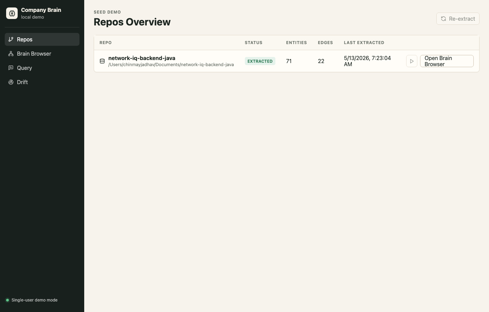
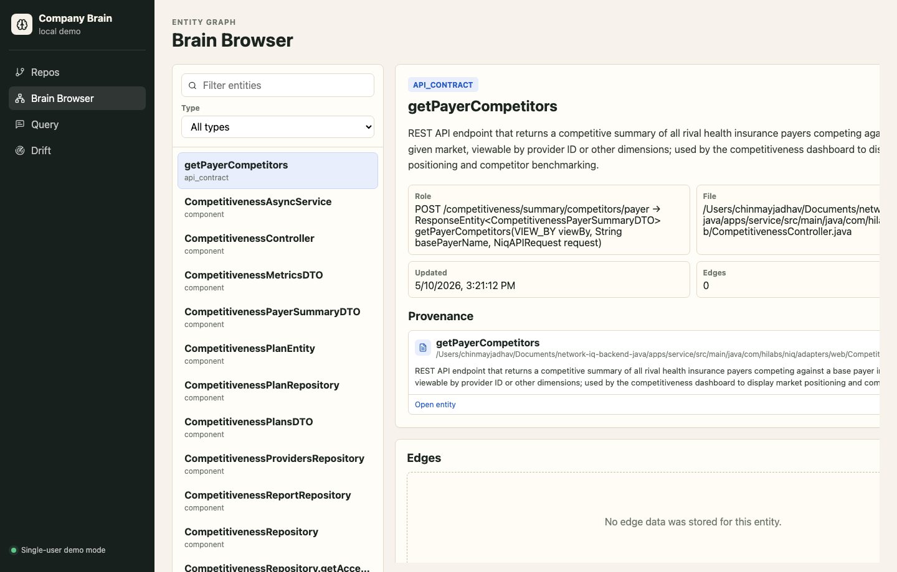
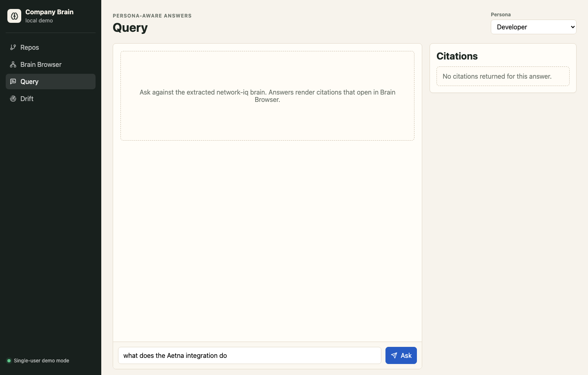
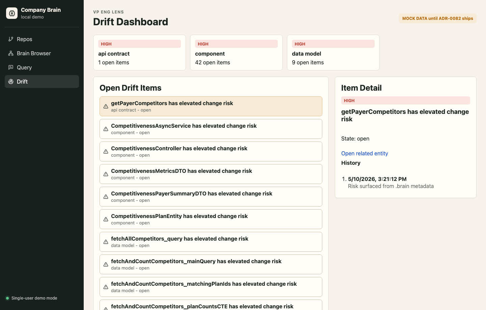

# Company Brain Demo Frontend

Vite + React 18 + TypeScript frontend for ADR-0071 P1. It wires the seed demo screens to the local brain API:

- Repos overview
- Brain Browser
- Query console with persona selector and citations
- Drift Dashboard with mock-marked ADR-0082 placeholder data

## Run Locally

```bash
cd frontend
npm install
npm run dev
```

Open http://localhost:5173.

The dev server proxies `/api` to the Python brain API. By default that target is `http://localhost:8000`, matching `make ai`. Override it when needed:

```bash
VITE_BRAIN_API_PROXY_TARGET=http://localhost:8080 npm run dev
```

Useful environment variables:

```bash
VITE_BRAIN_API_BASE_URL=/api
VITE_WORKSPACE_ID=00000000-0000-0000-0000-000000000001
VITE_DEMO_REPO_PATH=/Users/chinmayjadhav/Documents/network-iq-backend-java
```

## Smoke Test

```bash
cd frontend
npm run smoke
```

The smoke script starts Vite and checks `/repos`, `/browser`, `/query`, and `/drift` in Playwright for render-time console errors.

## Screenshots









## Prototype Audit

The design prototype at `/Users/chinmayjadhav/Documents/Company brain/` is a static CDN React/Babel export with no `package.json`. It contains `components.jsx`, `codebase.jsx`, `trace.jsx`, `push-flow.jsx`, `variations.jsx`, `design-canvas.jsx`, and `tweaks-panel.jsx`, backed by `data.js` mock data and `app.css`. For P1, this frontend keeps the same stack direction as the existing repo frontend, not the CDN prototype: Vite, React 18, React Query, React Router, lucide icons, and React Flow.
